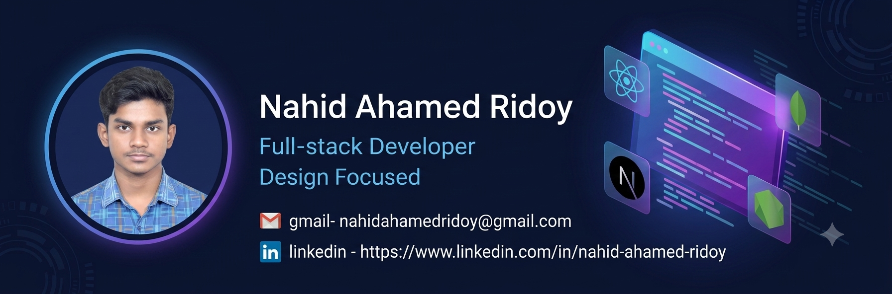

<h1 align="center">Hi 👋, I'm Nahid Ahamed Ridoy</h1>

<h3 align="center">
🚀 Full Stack Developer | MERN Stack Developer | React & Next.js Enthusiast
</h3>

---

# 👨‍💻 About Me

I'm **Nahid Ahamed Ridoy**, a passionate **Full Stack Developer** and Computer Science student with a strong interest in building modern, scalable, and user-friendly web applications.

I enjoy transforming ideas into real-world digital products using clean code, responsive interfaces, and efficient backend architecture.

I have hands-on experience with modern web technologies including **React.js, Next.js, Node.js, Express.js, MongoDB, Tailwind CSS**, and REST APIs.

My goal is to build impactful software, continuously improve my technical skills, and contribute to meaningful real-world projects.

---

# 🚀 Currently Working On

- 🔭 Building Full Stack Web Applications
- 🌱 Exploring Next.js & Backend Architecture
- ⚡ Improving Problem Solving Skills
- 💻 Learning Advanced MERN Stack Concepts
- 🚀 Building Scalable Applications
- 📚 Practicing Clean Code & Best Practices

---

# 🌍 Languages

| Language | Proficiency |
|----------|-------------|
| 🇧🇩 Bengali | Native |
| 🇬🇧 English | Professional Working |
| 🇮🇳 Hindi | Conversational |

---

# 🌐 Connect With Me

---

# 🛠 Tech Stack

### Frontend

### Backend

### Tools

---
# 🚀 Featured Projects

## 🏠 RentNest – Property Rental & Booking Platform

A modern **Full Stack Property Rental & Booking Platform** where tenants can browse and book properties, owners can manage listings, and administrators can control the platform through dedicated dashboards.

### ✨ Key Features

- 🔐 Secure Authentication & Authorization
- 👤 Role-Based Dashboard (Admin, Owner & Tenant)
- 🏠 Property Management
- 📅 Online Property Booking
- 💳 Stripe Payment Integration
- ❤️ Wishlist / Favorites
- 📱 Fully Responsive Design

### 🛠 Tech Stack

### 🌐 Live Demo

👉 https://a10-rent-nest.vercel.app

---

# 💼 My Projects

## 🏡 RentNest

**Live:** https://a10-rent-nest.vercel.app

A feature-rich property rental platform built with the MERN Stack.

### Features

- Property Listing & Search
- Authentication System
- Role-Based Dashboard
- Property Booking
- Stripe Payment
- Favorites Management
- Responsive UI

**Tech Stack**

React • Next.js • Tailwind CSS • Node.js • Express.js • MongoDB • Stripe

---

## 📚 StudyNook

**Live:** https://a9-study-nook-client.vercel.app

A study room booking platform that allows students to discover, reserve, and manage study rooms efficiently.

### Features

- Secure Login & Registration
- Study Room Booking
- Search & Filtering
- Dashboard Management
- JWT Authentication
- Responsive Design

**Tech Stack**

React • Node.js • Express.js • MongoDB • JWT • Tailwind CSS

---

### 🛒 SummerCart

🌐 **Live:** https://a8-sun-cart.vercel.app

A responsive e-commerce web application that provides a smooth online shopping experience.

**Key Features**

- Product Browsing
- Product Details
- User Authentication
- Responsive Design
- Smooth Shopping Experience

**Tech Stack**

React • JavaScript • Tailwind CSS • Firebase

---

## 🌐 Portfolio Website

A modern and responsive portfolio website showcasing my projects, technical skills, experience, and achievements as a Full Stack Developer.

### ✨ Key Features

- Responsive Design
- Modern UI/UX
- Project Showcase
- Skills & Technologies
- Contact Form
- Smooth Animations

### 🛠️ Tech Stack

React • Next.js • Tailwind CSS • Framer Motion

### 🔗 Live Website

👉 **https://protfolio-delta-nine.vercel.app**

---

---
# 📊 GitHub Statistics

  
  

---

# 🔥 GitHub Streak

  

---

# 🏆 GitHub Trophies

---

# 📈 Contribution Graph

---

# 🐍 Contribution Snake

---

# ⏰ Coding Activity

> **Note:** WakaTime card will only display data if you use WakaTime. If you don't use it, you can remove this section.

---

# 📈 Contribution Overview

---
# 💬 Random Developer Quote

---

# 📫 Contact Me

---

# 📧 Reach Me

- 📧 **Email:** nahidahamedridoy@gmail.com
- 💼 **LinkedIn:** https://www.linkedin.com/in/nahid-ahamed-ridoy
- 💻 **GitHub:** https://github.com/Nahidahamedridoy
- 📍 **Location:** Bangladesh

---

# 🤝 Let's Collaborate

I'm always open to:

- 🚀 Full Stack Web Development Projects
- 💼 Internship Opportunities
- 🌱 Open Source Contributions
- 🤝 Collaboration on Innovative Ideas
- 💬 Tech Discussions

If you have an exciting project or opportunity, feel free to connect with me!

---

# 💖 Support My Work

If you like my projects, consider giving them a ⭐.

It motivates me to build more amazing applications and contribute to the developer community.

---

# ⚡ Fun Fact

> "First, solve the problem. Then, write the code." — John Johnson

---

<h3 align="center">

Thanks for visiting my GitHub Profile ❤️

</h3>

⭐ If you like my work, don't forget to star my repositories.

